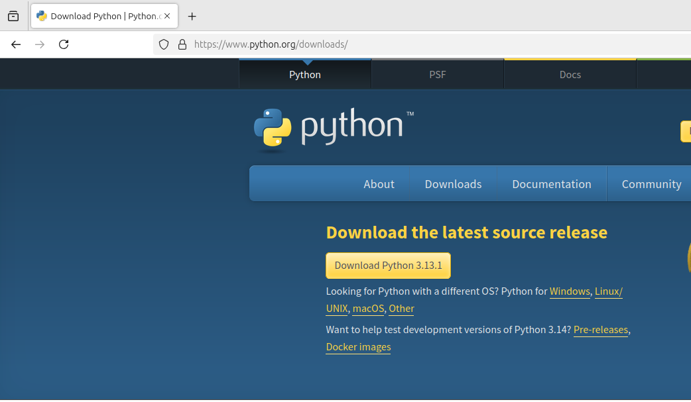

# I. Python Programming Concepts.

## Installing

Visit python.org/downloads and download the latest release for your OS.



## hello world!

```
print('hello world')
>>> hello world
```

## Python Compiler & IDE

### Jupyter Notebook & Anaconda
Visit 

### Google Colab

### VS Code/ PyCharm/ Spyder

Comments


## Data Types
### int

### float

### string

### bool

## Storing data
### list

### dict

### set

### tuple

## Operators

### Arithmetic

### Relational

### Logical


## Comments

white space. Comment types, docstrings, formatting
